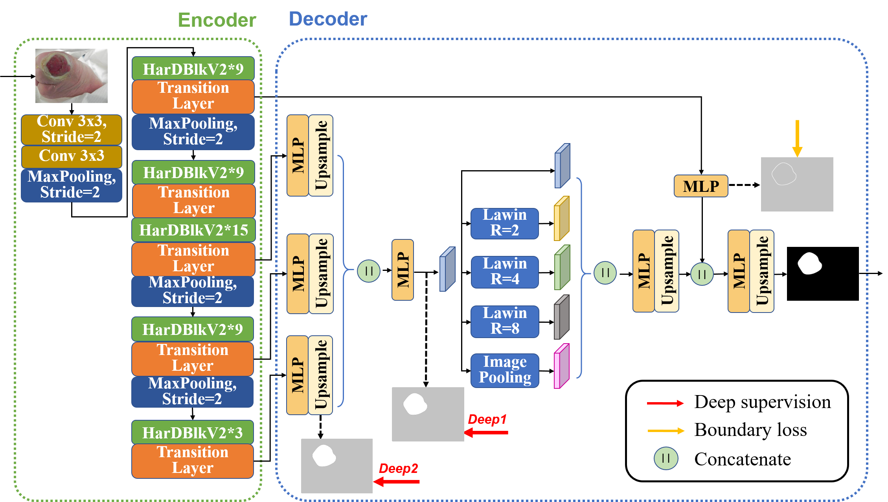

# HarDNet-DFUS: An Enhanced Harmonically-Connected Network for Colonoscopy Polyp Segmentation

> Arxiv Paper : [**HarDNet-DFUS: An Enhanced Harmonically-Connected Network for Diabetic Foot Ulcer Image Segmentation and Colonoscopy Polyp Segmentation**](https://arxiv.org/abs/2209.07313)

> This GitHub is for **polyp segmentation**.

> For Diabetic Foot Ulcer Image Segmentation, see **https://github.com/kytimmylai/DFUC2022**.

> For Skin Lesions Segmentation, see **https://github.com/wendyliao00/HarDNet-DFUS**.

## HarDNet Family
#### For Image Classification : [HarDNet](https://github.com/PingoLH/Pytorch-HarDNet) 78.0 top-1 acc. / 1029.76 Throughput on ImageNet-1K @224x224
#### For Object Detection : [CenterNet-HarDNet](https://github.com/PingoLH/CenterNet-HarDNet) 44.3 mAP / 60 FPS on COCO val @512x512
#### For Semantic Segmentation : [FC-HarDNet](https://github.com/PingoLH/FCHarDNet)  75.9% mIoU / 90.24 FPS on Cityscapes test @1024x2048
#### For Polyp Segmentation : [HarDNet-MSEG](https://github.com/james128333/HarDNet-MSEG) 90.4% mDice / 119 FPS on Kvasir-SEG @352x352


## Main Results

### Performance on Kvasir-SEG Dataset 1450
(Training/Testing split = 1450 from 5 datasets /100 from Kvasir-SEG according to [PraNet: Parallel Reverse Attention Network for Polyp Segmentation](https://arxiv.org/abs/2006.11392)) (FPS measures on 2080Ti)
|                 Models                 | mDice | mIoU  |  wfm  |  Sm   |  MAE  | maxEm | FPS |
|:--------------------------------------:|:-----:|:-----:|:-----:|:-----:|:-----:|:-----:|:---:|
|                 U-Net                  | 0.818 | 0.746 | 0.794 | 0.858 | 0.055 | 0.893 | 11  |
|                U-Net++                 | 0.821 | 0.743 | 0.808 | 0.862 | 0.048 | 0.910 | 25  |
|                  SFA                   | 0.723 | 0.611 | 0.67  | 0.782 | 0.075 | 0.849 | 40  |
|                 PraNet                 | 0.898 | 0.840 | 0.885 | 0.915 | 0.030 | 0.948 | 66  |
|              HarDNet-MSEG              | 0.912 | 0.857 | 0.903 | 0.923 | 0.025 | 0.958 | **88**  |
|              HarDNet-DFUS              | 0.918 | 0.864 | 0.911 | 0.920 | 0.024 | 0.956 | 22  |
| HarDNet-DFUS <br> with 5-Fold ensemble | **0.924** | **0.872** | **0.919** | **0.925** | **0.022** | **0.962**|  4  |


#### Performance on other Polyp Segmentation Dataset
(FPS measures on V100) meandice
|                 Models                 | Kvasir <br> mDice | ClinicDB <br> mDice | ColonDB <br> mDice | ETIS <br>  mDice | CVC-T <br>  mDice |   FPS   |
|:--------------------------------------:|:-----------------:|:-------------------:|:------------------:|:----------------:|:-----------------:|:-------:|
|              HarDNet-MSEG              |       0.912       |        0.932        |       0.731        |      0.677       |       0.887       | **108** |
|              HarDNet-DFUS              |       0.918       |      **0.939**      |     **0.774**      |      **0.730**       |       0.876       |   30    |
| HarDNet-DFUS <br> with 5-Fold ensemble |     **0.924**     |        0.932        |       0.773        |      **0.730**       |     **0.896**     |    6    |

(FPS measures on V100) mIoU
|                 Models                 | Kvasir <br> mIoU  | ClinicDB <br> mIoU  | ColonDB <br> mIoU  | ETIS <br>  mIoU  | CVC-T <br>  mIoU  |   FPS   |
|:--------------------------------------:|:-----------------:|:-------------------:|:------------------:|:----------------:|:-----------------:|:-------:|
|              HarDNet-MSEG              |      0.857        |        0.882        |       0.660        |      0.613       |     0.821        | **108** |
|              HarDNet-DFUS              |      0.864        |      **0.893**      |       0.695        |      0.646       |     0.796        |   30    |
| HarDNet-DFUS <br> with 5-Fold ensemble |    **0.871**      |        0.885        |     **0.703**      |    **0.659**     |    **0.824**     |    6    |

### Performance on Kvasir-SEG Dataset 1000
(Training/Validating/Testing split = 800/100/100 according to [FCN-Transformer Feature Fusion for Polyp
Segmentation](https://arxiv.org/abs/2208.08352))(FPS measures on 2080Ti)
|                 Models                 | mDice | mIoU  |  wfm  |  Sm   |  MAE  | maxEm | FPS |
|:--------------------------------------:|:-----:|:-----:|:-----:|:-----:|:-----:|:-----:|:---:|
|                 U-Net                  | 0.7821 | 0.8141 | - | - | - | - | -  |
|                 PraNet                 | 0.9011 | 0.8403 | - | - | - | - | -  |
|              HarDNet-MSEG              | 0.9139 | 0.8624 | - | - | - | - | **88**  |
|              SSFormer                  | 0.9357 | 0.8905 | - | - | - | - | -  |
|              FCBFormer                 | **0.9385** | **0.8903** | - | - | - | - | -  |
|              HarDNet-DFUS              | 0.9363 | 0.8894 | - | - |- | - | 22  |

#### Performance on other Polyp Segmentation Dataset
(FPS measures on V100) meandice
|                 Models                 | Kvasir <br> mDice | ClinicDB <br> mDice |   FPS   |
|:--------------------------------------:|:-----------------:|:-------------------:|:-------:|
|              HarDNet-MSEG              |       0.9139       |        0.8723        | **108** |
|              SSFormer                  |       0.9357       |      0.8339      |   -    |
|              HarDNet-DFUS              |       0.9363       |      **0.8945**      |   30    |
|              FCBFormer                 |       **0.9385**       |      0.8735      |   -    |

(FPS measures on V100) mIoU
|                 Models                 | Kvasir <br> mIoU | ClinicDB <br> mIoU |   FPS   |
|:--------------------------------------:|:-----------------:|:-------------------:|:-------:|
|              HarDNet-MSEG              |       0.8624       |        0.8134        | **108** |
|              SSFormer                  |       **0.8905**       |      0.7573      |   -    |
|              HarDNet-DFUS              |       0.8894       |      **0.8370**      |   30    |
|              FCBFormer                 |       0.8903       |      0.8038      |   -    |

### Sample Inference and Visualized Results of Kvasir-SEG Dataset
<p align="center">

</p>


## HarDNet-DFUS Architecture
<p align="center">

</p>


## Installation & Usage
- Environment setting (Prerequisites)
    ```
    conda create -n dfuc python=3.6
    conda activate dfuc
    pip install -r requirements.txt
    ```

- Downloading necessary data:
    **For each Dataset training including Kvasir-SEG, CVC-ColonDB, EndoScene, ETIS-Larib Polyp DB and CVC-Clinic DB from**
    [**PraNet: Parallel Reverse Attention Network for Polyp Segmentation**](https://arxiv.org/abs/2006.11392)
    
    + downloading testing dataset and move it into your test_path
    which can be found in this [download link (Google Drive)](https://drive.google.com/file/d/1o8OfBvYE6K-EpDyvzsmMPndnUMwb540R/view?usp=sharing).
    
    + downloading training dataset and move it into your train_path
    which can be found in this [download link (Google Drive)](https://drive.google.com/file/d/1lODorfB33jbd-im-qrtUgWnZXxB94F55/view?usp=sharing).

### Training

1. Download pretrain_weight: [kingnet53.pth for HarDNetV2-53](https://drive.google.com/drive/folders/1UbuMKLUlCsZAusUVLJqwcBaXiwe0ZUe8?usp=sharing) and place in the folder ``` /weights ``` 
2. Run:
    ```
    python train.py --rect --augmentation --data_path /path/to/training/data

    Optional Args:
    --rect         Padding image to square before resize to keep its aspect ratio
    --augmentation Activating data audmentation during training
    --kfold        Specifying the number of K-Fold Cross-Validation
    --k            Training the specific fold of K-Fold Cross-Validation
    --dataratio    Specifying the ratio of data for training
    --seed         Reproducing the result of data spliting in dataloader
    --data_path    Path to training data
    ```

### Testing

Run:
```
python test.py --rect --weight path/to/weight/or/folder --data_path path/to/testing/data

Optional Args:
--rect         Padding image to square before resize to keep its aspect ratio
--tta          Test time augmentation, 'v/h/vh' for verti/horiz/verti&horiz flip
--weight       It can be a weight or a fold. If it's a folder, the result is the mean of each weight result
--data_path    Path to testing data
--save_path    Path to save prediction mask
```

### Evaluation
Run:
```
python evaluate.py --image_root path/to/image/folder --gt_root path/to/ground truth/folder

Optional Args:
--image_root    Path to predict result data
--gt_root       Path to ground truth data
```


## Acknowledgement
- This research is supported in part by a grant from the **Ministry of Science and Technology (MOST) of Taiwan**.   
We thank **National Center for High-performance Computing (NCHC)** for providing computational and storage resources.        

## Citation
If you find this project useful for your research, please use the following BibTeX entry.
```
  @misc{2022hardnetdfus,
  title = {HarDNet-DFUS: An Enhanced Harmonically-Connected Network for Diabetic Foot Ulcer Image Segmentation and Colonoscopy Polyp Segmentation},
  author = {Liao, Ting-Yu and Yang, Ching-Hui and Lo, Yu-Wen and Lai, Kuan-Ying and Shen, Po-Huai and Lin, Youn-Long},
  year = {2022},
  eprint={2209.07313},
  archivePrefix={arXiv},
  primaryClass={cs.CV}
  }

  @inproceedings{chao2019hardnet,
  title={Hardnet: A low memory traffic network},
  author={Chao, Ping and Kao, Chao-Yang and Ruan, Yu-Shan and Huang, Chien-Hsiang and Lin, Youn-Long},
  booktitle={Proceedings of the IEEE International Conference on Computer Vision},
  pages={3552--3561},
  year={2019}
  }
```
